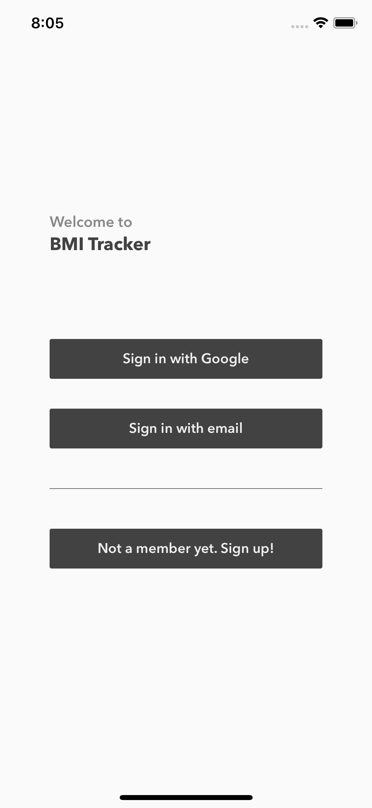
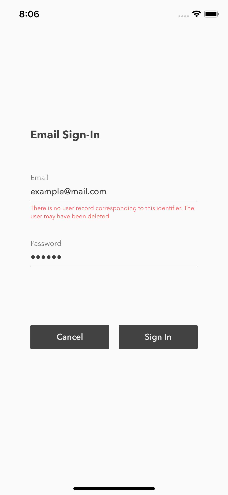
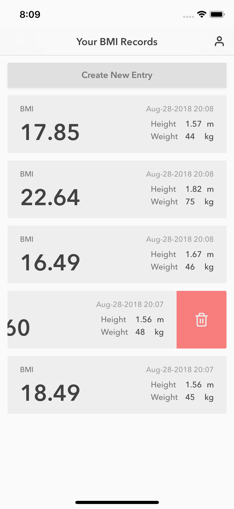
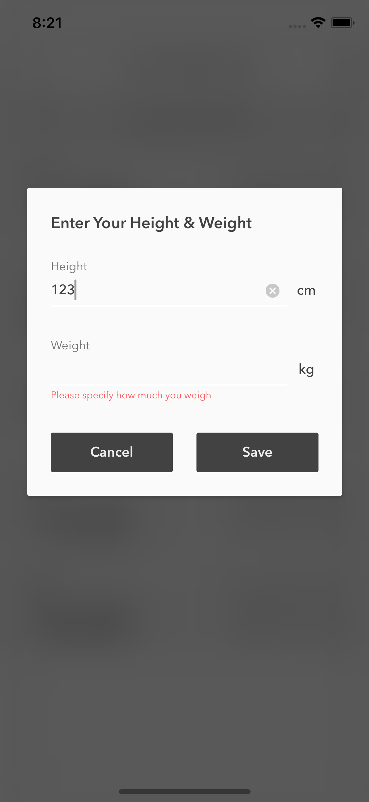
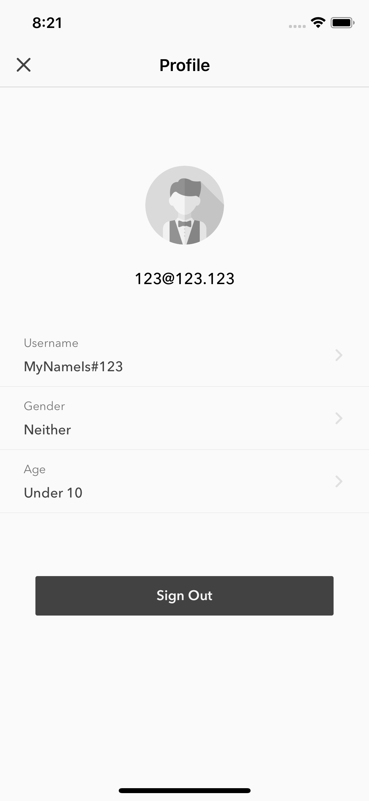

## Brief
This project demonstrates the combination of using of Firebase & RxMVVM pattern by creating BMI-tracking service on iOS mobile, where allowing users to perform features like sign-up / sing-in, BMI record create / delete, and basic user profile maintenance.

## Screenshots

## Dependency
[Firebase Auth](https://firebase.google.com/docs/auth/ios/start?authuser=0) - Email SignUp/SignIn, Google SignIn

[Firebase Database](https://firebase.google.com/docs/database/ios/start?authuser=0) - Source of user BMI records

[Firebase Storage](https://firebase.google.com/docs/storage/ios/start?authuser=0) - Used for user portrait image

[RxSwift / RxCocoa](https://github.com/ReactiveX/RxSwift) - Reactive Programming in Swift

[RxDataSources](https://github.com/RxSwiftCommunity/RxDataSources) - for record list as Sectioned UICollectionView

[RxGesture](https://github.com/RxSwiftCommunity/RxGesture) - customized swipe-to-delete for UICollectionViewCell

[Kingfisher](https://github.com/onevcat/Kingfisher) - Download and cache images from urls.

## License
MIT
